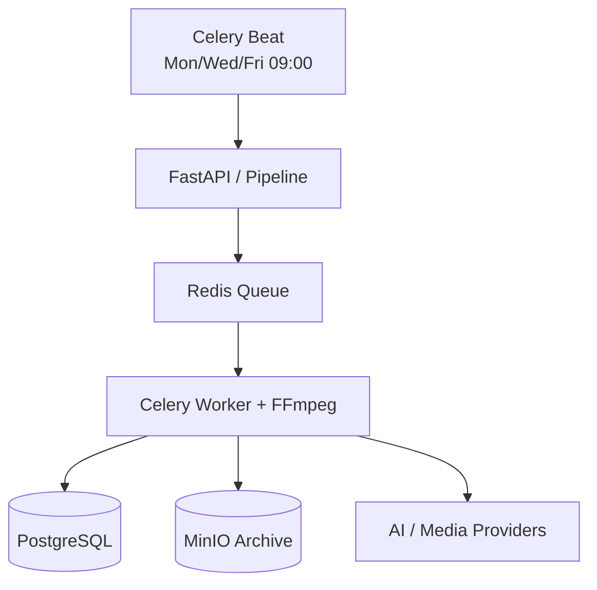

# AI Reels Factory

ระบบผลิตวิดีโอ Reels อัตโนมัติบน Ubuntu + Docker:

`Research → Script → B-roll → Voice → Caption → Render → QC → Archive`

## Architecture



รายละเอียดอยู่ที่ [docs/ARCHITECTURE.md](docs/ARCHITECTURE.md)

## Quick start

```bash
cp .env.example .env
# แก้รหัสผ่านและ API keys ใน .env
docker compose config
docker compose up -d --build
docker compose ps
curl -fsS http://localhost:8080/health
```

> การรันครั้งแรกโดยไม่ใส่ API key จะใช้ fallback media/เสียงเงียบเพื่อพิสูจน์การไหลของระบบเท่านั้น งานเผยแพร่จริงควรใส่ provider keys และตรวจเนื้อหาโดยมนุษย์ก่อน post

Frontend: `http://VPS-IP:8080/`

API docs: `http://VPS-IP:8080/docs`

MinIO Console: `http://VPS-IP:9001`

สร้างคลิปด้วยตนเอง:

```bash
curl -X POST http://localhost:8080/jobs \
  -H 'Content-Type: application/json' \
  -d '{"topic":"AI ในโรงพยาบาล","language":"th","target_seconds":45}'
```

ดูสถานะ:

```bash
curl http://localhost:8080/jobs/JOB_ID
```

ดาวน์โหลดวิดีโอเมื่อสถานะเป็น `completed`:

```bash
curl -OJ http://localhost:8080/jobs/JOB_ID/video
```

## Production checklist

- เปลี่ยน password/secret ทุกค่าใน `.env`
- ใส่ `OPENAI_API_KEY`; ใส่ `PEXELS_API_KEY` หากต้องการ stock B-roll
- เปิด port 8080/9001 เฉพาะ IP ผู้ดูแล หรือวางหลัง HTTPS reverse proxy
- สำรอง Docker volumes: `postgres_data`, `minio_data`
- รัน `bash scripts/smoke-test.sh` หลัง deploy
